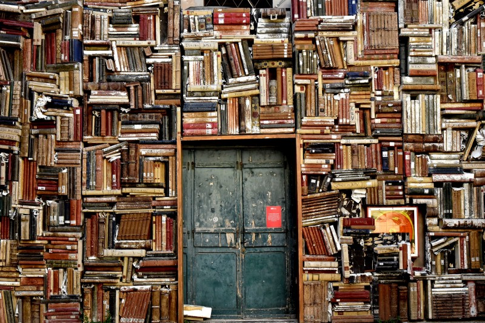

# How Books and Television Affect Your Brain Differently

## Are Books Superior to TV?
### How they affect our brains differently, according to science

There’s a perception that books are good, while TV is bad. Spend a day curled up with a book and you’re an intellectual, but spend a day watching your favorite show and you become a couch potato.

Similar to how candy gives you cavities and sun tanning is bad for our skin, it’s common knowledge that reading books is good for you. It increases your knowledge and makes you think. Watching television on the other hand kills off brain cells.

But why is that? Why can’t watching TV be just as educational as reading a book? For example, does watching the show Game of Thrones lower your intelligence, while reading the books does the exact opposite?

After all, there are all sorts of books. Some good, some poorly written. The same applies to shows as well. Is the situation as simple as categorizing books as good and TV as bad?

## What Science Says About Books and Television

In 2013, a study was performed at Tohoku University in Japan. A team led by Hiraku Takeuchi examined the effects of television on the brains of 276 children, along with amount of time spent watching TV and its long-term effects.

Researcher Takeuchi found that the more TV the kids watched, parts of their brain associated with higher arousal and aggression levels became thicker. The frontal lobe also thickened, which is known to lower verbal reasoning ability.

The more hours of television the kids watched, the lower their verbal test results became. These negative effects in the brain happened regardless of the child’s age, gender, and economic background.

In the same year, a study was done on how reading a novel affected the brain. Gregory Burns and his colleagues at Emory University wanted to see the before and after effects of reading based on fMRI readings.

College students were asked to read Pompeii by Robert Harriss, a thriller based on the eruption of Mount Vesuvius in Italy. The book was chosen due to its strong narration and a dramatic plot based on true events.

After reading the novel, the students had increased connectivity in parts of the brain that were related to language. There was also increased activity in the sensory motor region of the brain, suggesting that readers experienced similar sensations to the characters in the book.

There are also long-term effects from reading books. Reading keeps your mind alert and delays cognitive decline in elders. Research even found that Alzheimer’s is 2.5 times less likely to appear in elderly people who read regularly, while TV was presented as a risk factor.

Six minutes of reading can reduce stress levels by 68 percent, according to researchers at the University of Sussex. Reading beat out other relaxing activities, including listening to music (61 percent), drinking tea or coffee (54 percent), and taking a walk (42 percent).

## Why These Activities Have Opposite Effects on Us

So far, reading’s looking pretty good compared to television. We can see that it calms the nerves, increases language and reasoning, and can even keep you mentally alert as you age. TV, on the other hand, has the opposite effect.

But we still haven’t gotten to why that’s the case.

Let’s look first at a study on how preschoolers and toddlers interact with their mothers during TV viewing versus reading a book.

The results found that watching TV resulted in lower amounts and quality of communication between the mother and child. During an educational TV program, mothers made few comments to their children, and if they did, it was unrelated to what their children said.

On the other hand, reading books together increased the amount and level of communication. Mothers were more likely to ask their child questions, respond to their child’s statements and questions, and explain concepts in greater detail.

Beyond mothers and their children, it’s not just an issue of the quality of the TV program or the book. It seems that the nature of the activities themselves is what’s causing the differences.

Television is designed to be passive. After switching to the show you like, you can just sit back and watch everything unfold without effort on your part. You’re less likely to pause to reflect on what’s happening.

TV also presents ideas and characters on a surface level. Shows don’t have the luxury of describing or explaining situations in great detail, since they need to keep viewers visually entertained. TV programs are fast-paced in order to keep people from switching.

Books, on the other hand, are a more proactive form of entertainment and learning. The reader has to concentrate on what’s being said and to think through concepts in the book. When we read, we’re forced to use our imaginations to fill in the gaps.

Books also have the advantage of being able to describe everything in greater depth. While television is mostly composed of dialogue between characters, books can walk readers through scenes, characters’ thoughts, and provide lengthier commentary.

So now that we’ve seen the benefits of reading, how can we fit more of it into our lives?

## Break Away From Your Environment

If you’re glued to the television set constantly, it’s largely because of the environment that that you’re in. Surround yourself with people who talk about TV shows, and you’ll be more likely to watch them yourself. Place yourself within arm’s reach of a remote, and it becomes easier to watch TV. Flip on the switch as soon as you get home, then it becomes a habit.

So how can you go from watching TV to reading something that will help you grow as a person?

The first thing you can do to break the habit is to change your environment. Being in the same environment for a long time encourages you to keep doing the same things. But go to a completely new place, and you immediately drop your habits.

For instance, if you travel somewhere, you immediately have to adapt and create different habits. You’re exposed to a different way of life, and your everyday activities change drastically. Your TV watching habit can easily go from 5 hours a day to zero when you’re in a new environment.

While it might not be feasible to move somewhere new, you can take a brief vacation from your routine. Taking a break and traveling gives you a different perspective on everyday life, and it also forces you to develop new routines. When you return home, you can start fresh on your habits.

You can also break away from your environment by re-arranging your current space. Using the concept of environmental cues, I recommend setting up your office and entertainment space so that it’s easier to pick up productive activities.

## Choose the Right Books

The next thing you can do is pick the books that will give you the most value out of your time. If you have a choice between an e-book and a paper book, choose the latter.

Here are a few reasons why paper books are better:
1. Readers who use paper books have an easier time remembering the content than tablet readers. Traditional books provide a sense of progress as readers flip through the pages, along with greater immersion (i.e. you can’t click away from your book), which is key to absorbing information.
2. Light from e-readers interferes with sleeping patterns, while paper books actually help you sleep better.
3. Using electronic devices such as e-readers is linked to higher stress and depression levels. Traditional books, on the other hand, help reduce stress.

If you’re not sure when to fit in some reading, try setting aside time in the morning or evenings.

For myself, I like to dedicate half an hour before bed to read a book. It’s not a big chunk of time, and it also helps me wind down before it’s time to sleep.

During the day, I often bring a book with me when I head out in case I need to wait or have a moment to spare.

If you’re stuck on what to read, you can try going through my book list and seeing what interests you. I have found that reading a good book helps me to de-stress and gives me new ideas for improving myself.

If books bring back dreary memories of mandatory reading in school, try picking a book on a topic that interests you. I think you’ll find that reading rewards your personal growth in ways that television can’t replace.
